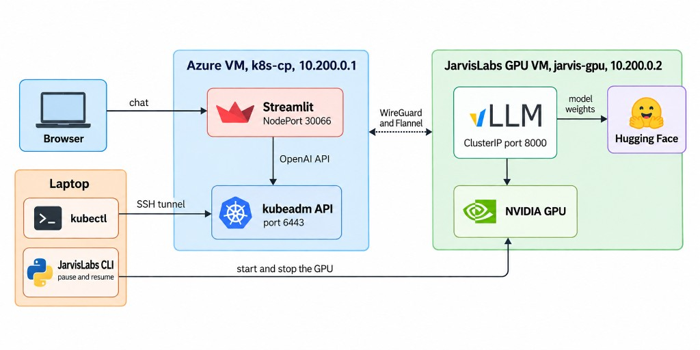

# LLM deployment

Chat with an open model. vLLM runs on a JarvisLabs GPU VM. The Streamlit page runs on an Azure VM.

Model, GPU, and context length are in [`manifest.yaml`](manifest.yaml).

## How it fits together



## Start and stop

The GPU bills while it is running. Resume it when you want to chat, and pause it when you stop.

```bash
bash scripts/gpu-resume.sh
```

Open `http://<azure-public-ip>:30066`. Allow TCP 30066 from your IP in the Azure network security group. The sidebar turns green when vLLM is ready. After a pause, that takes a few minutes.

```bash
bash scripts/gpu-pause.sh
```

Pause stops compute billing and keeps the disk, so the model stays downloaded. `jarvis-gpu` shows NotReady until you resume. The Azure VM stays up, and the page loads again after resume.

Delete the GPU VM and its disk:

```bash
bash scripts/gpu-destroy.sh
```

Pause and resume need the JarvisLabs CLI (`pip install -r requirements-operator.txt`, then `jl setup` or `JL_API_KEY`). They use the machine id in `.k8s-gpu-state`.

## kubectl

From this repo, on your laptop:

```bash
bash scripts/k8s-access.sh
kubectl get nodes
kubectl -n llm get pods
kubectl -n llm logs -f deploy/vllm
```

`scripts/k8s-access.sh` reads `.k8s-cp-state` and opens an SSH tunnel to the API. Run it again if `kubectl` cannot connect.

## Change the model

Edit `model` in `manifest.yaml`. For a gated Hugging Face model, copy `.env.example` to `.env` and set `HF_TOKEN`.

```bash
export UI_IMAGE=llm-deployment-ui:latest
bash scripts/k8s-apply.sh
```

`UI_IMAGE` is the Streamlit image the cluster can run. vLLM uses the public `vllm/vllm-openai` image and is scheduled only on the GPU node.

## Call the API

Inside the cluster the OpenAI-compatible API is `http://vllm.llm.svc.cluster.local:8000/v1`.

```bash
kubectl -n llm port-forward svc/vllm 8000:8000
VLLM_BASE_URL=http://127.0.0.1:8000/v1 python examples/chat.py "Hello"
```

## Set up the cluster

One Azure VM is the control plane. One JarvisLabs GPU VM joins it. The full setup is [docs/K8S.md](docs/K8S.md).

To run vLLM and Streamlit on a single JarvisLabs machine, without Kubernetes, use [docs/GUIDE.md](docs/GUIDE.md).

## License

Apache-2.0. See [LICENSE](LICENSE).
